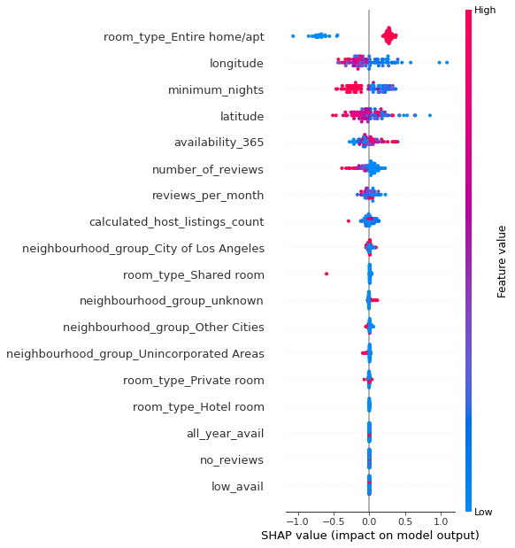
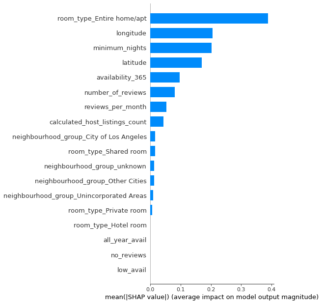

# Predicting Los Angeles House Price

[EDA notebook](https://nbviewer.org/github/JoKerDii/Predicting-Airbnb-House-Price/blob/main/main-notebook/Airbnb_losangeles_eda.ipynb), [Model notebook](https://nbviewer.org/github/JoKerDii/Predicting-Airbnb-House-Price/blob/main/main-notebook/Airbnb_losangeles_modeling.ipynb)

## Overview

Since 2008, guests and hosts have used Airbnb to expand on traveling possibilities in a more unique, personalized way. Nowadays, Airbnb became one of the most widely used service in the whole world. Data analysis on millions of listings provided through Airbnb is crucial for the company to understand customers' and providers' behavior and performance, make business decisions, guide marketing initiatives, implement innovative additional services, etc.

In this project, we aim to achieve the following goals:

1. Build a predictor that can accurately predict prices of Airbnb rentals in Los Angeles based on the information about geographic location, hosts, etc. 
2. Develop the predictor to a web app so that users can easily use it to predict house prices by providing relevant information.

The significance of this project is the predictor we built enables user to predict the value of the target Airbnb houses given geographical features and information about the customers, hosts, and the services.

## Data Source

The dataset contains information about hosts, geographic locations, neighborhood areas, room types, reviews, availability, house price, etc. The version of the dataset used throughout this project was reported in 2022. It contains 42,041 records and 18 variables. The latest version of the house price data in LA is available from the Inside Airbnb [website](http://insideairbnb.com/los-angeles/). 

We preprocessed the data and then went through exploratory data analysis, and feature engineering. Please refer to the notebook for more information.

## Model

The response variable is 'price'. Other variables as well as engineered variables are predictors. Specifically, we built several linear models and non parametric models to predict price based on covariates, and improved the models by tuning hyperparameters through searching techniques. We used RMSE metric calculated from 5-fold cross-validation to evaluate and compare model performance.

We fitted and compared three linear models: Ridge regression, Lasso regression, and Huber regression models. Ridge regression model works better than others. In addition, we built and compared two non-parametric models: random forest regressor and XGBoost regressor. In general, non-parametric models perform a lot better than linear models. **XGBRegressor** achieves the lowest cross-validation RMSE.

## Results and Discussion

The cross-validation RMSE values are summarized in the following table.

| Algorithms              | Cross-validation RMSE (default) | Cross-validation RMSE (improved) | Test RMSE (default) | Test RMSE (improved) |
| ----------------------- | ------------------------------- | -------------------------------- | ------------------- | -------------------- |
| Ridge Regression        | 0.430442                        | 0.430442                         | -                   | -                    |
| LASSO Regression        | 0.749704                        | 0.430444                         | -                   | -                    |
| Huber Regression        | 0.436043                        | 0.436043                         | -                   | -                    |
| Random Forest Regressor | 0.277271                        | 0.276179                         | 0.273719            | 0.273233             |
| XGB Regressor           | 0.303805                        | 0.274842                         | 0.300956            | 0.267921             |

Among linear models, LASSO regression performed the worst since it ignores one potentially important variable - minimum nights. Non-parametric models perform better than linear models in general. 

With the help of ELI5 and LIME explainer, we have some interesting findings. From the coefficient estimates of Lasso Regression model, we learn that availability365, calculated host listings count, all year availability, shared room type are positively related to the price, while no reviews, unincorporated areas, other cities, latitude contribute to the price in the negative direction. We find that for random forest regressor and XGB regressor, entire home/apt variables appear to be the most important variable.

With the help of SHAP explainer, we interpreted XGBoost regression model. The dot plot shows how the values of each feature contribute to the price prediction. The bar plot shows the feature importance. It shows that houses with entire home/apt type of room tend to be more expensive, while houses with large latitude/latitude, more minimum nights tend to be cheaper. 

**Figure 1. SHAP Summary Dot Plot.** 



**Figure 2. SHAP Summary Bar Plot.**



## Conclusion and Future Work

In this project, we built and compared several models for predicting house prices in Los Angeles. Compared to other models, XGBoost Regressor achieved the lowest RMSE. In addition, we developed our predictor into a web app by using FastAPI. 

There are a few reasons why linear models perform worse than non-parametric models. First, linear models are too simple to solve complex problems and so easily underfit the data. Non-parametric models are usually flexible and powerful enough to achieve better fit and performance. In addition, the non-parametric models we chose are ensemble models, which can achieve better performance than any single contributing model.

One of the limitations of this project is that feature engineering was not creative enough. There are a lot more engineering ideas we can implement using this rich data. For example, the neighborhood is a sparse feature with ~300 different levels, but it's important in predicting the price. From the exploratory analysis we found houses close to the beach are more expensive. However, we didn't have enough time to explore and make the most use of it. For future work, we could label encode those levels and let tree-based model to make use of it, or apply advanced dimensionality reduction techniques such as k-means, DBSCAN, PCA, to cluster neighborhoods into groups with fewer levels. In addition, with coordinates information, since house prices are highly dependent on the locations, another feature engineering idea is to identify interesting areas in Los Angeles and add a feature as the geographic distance to those areas or a feature as the number of interesting areas in the surrounding area.

## FastAPI

Clone the repo

```bash
git clone https://github.com/JoKerDii/Predicting-Airbnb-House-Price.git
```

Download dependencies

```
pip install -r requirements.txt
```

Run app.py

```
cd APP
python3 app.py
```

Open the local web server 'http://127.0.0.1:8000'